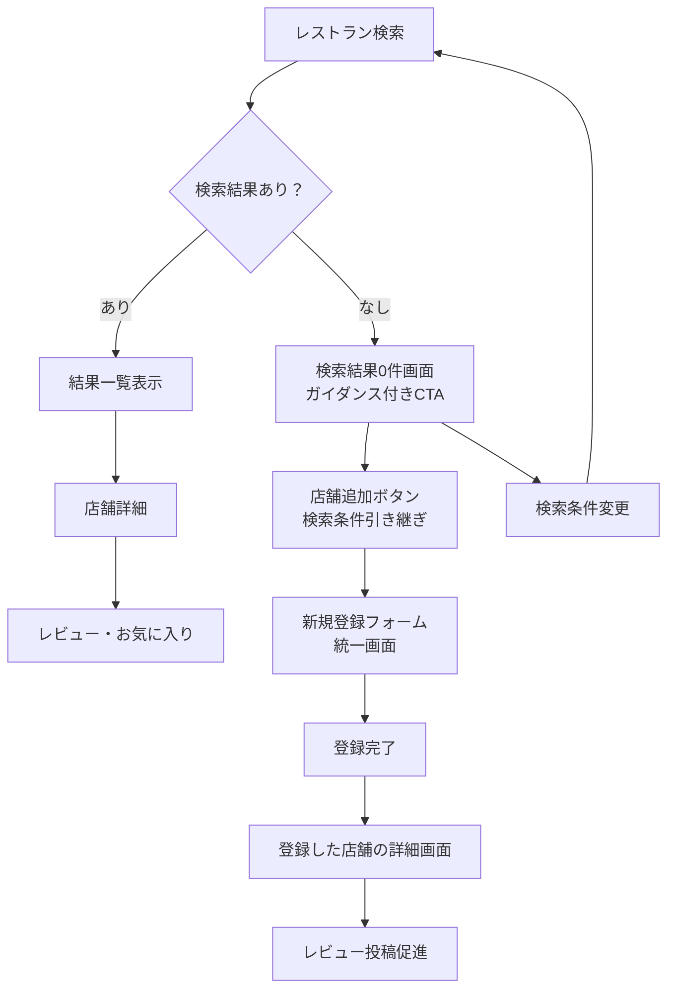

# UXフロー設計: 検索→登録動線

## 概要

レストラン検索で該当店舗が見つからない場合の登録誘導動線を設計し、ユーザーが積極的に店舗データベースへ貢献できる仕組みを構築する。

## 1. 検索結果0件時の改善

### 現在の問題
- 「該当する店舗がありません。」のメッセージのみ
- 次のアクションへの誘導なし
- 貢献機会の損失

### 改善案: ガイダンス付きCTA

```
┌─────────────────────────────────────────────────┐
│ 🔍 該当する店舗がありません。                      │
│                                                 │
│ TOKIEATSは皆で作る店舗データベースです。          │
│ 新しい店舗を追加して、チームに情報を共有しませんか？ │
│                                                 │
│ 💡 追加方法のガイド：                            │
│ • 基本情報（店名・場所・ジャンル）を入力          │
│ • 詳細情報は後から追加・編集可能                  │
│ • チームメンバーがすぐに参考にできます            │
│                                                 │
│ [📝 この店舗を追加する]  [🔄 検索条件を変更する]   │
└─────────────────────────────────────────────────┘
```

**実装ポイント:**
- 初回ユーザーには特に丁寧なガイダンス表示
- 貢献の価値（チーム共有）を明示
- 簡単さをアピール（「後から追加・編集可能」）

## 2. 検索→登録のスマート連携

### 検索情報の自動引き継ぎ

**URLパラメータでの情報受け渡し:**
```
検索: 「焼肉店」（渋谷、焼肉ジャンル）
↓
/restaurants/new?name=焼肉店&area=渋谷&genre=焼肉
```

**新規登録フォームでの処理:**
- 店舗名フィールドに検索ワードを自動入力
- エリア・ジャンルのドロップダウンを自動選択
- ユーザーは確認・修正するだけで登録可能

### 実装仕様

**検索画面（/restaurants）:**
```typescript
// 店舗追加ボタンクリック時
const handleAddRestaurant = () => {
  const params = new URLSearchParams();
  if (searchName) params.set('name', searchName);
  if (selectedArea) params.set('area', selectedArea);
  if (selectedGenre) params.set('genre', selectedGenre);
  
  router.push(`/restaurants/new?${params.toString()}`);
};
```

**登録画面（/restaurants/new）:**
```typescript
// URLパラメータからの初期値設定
const searchParams = useSearchParams();
const initialName = searchParams.get('name') || '';
const initialArea = searchParams.get('area') || '';
const initialGenre = searchParams.get('genre') || '';
```

## 3. 全体動線フロー



## 4. 登録フォーム統一仕様

### 単一フォーム設計

**必須項目（最小限）:**
- 店舗名
- エリア（タグ選択）
- ジャンル（タグ選択）

**任意項目（詳細情報）:**
- 住所
- 電話番号
- 営業時間
- 説明・コメント
- 写真アップロード

**UX配慮:**
- 「必須」「任意」の明確な区別
- 「とりあえず保存」と「詳細まで入力」の選択肢
- プログレッシブディスクロージャー（詳細項目は折りたたみ可能）

### フォーム構成案

```
┌─────────────────────────────────────┐
│ 📝 新しい店舗を追加                   │
│                                     │
│ ■ 基本情報（必須）                   │
│ 店舗名: [____________________]       │
│ エリア: [渋谷 ▼]                    │
│ ジャンル: [焼肉 ▼]                   │
│                                     │
│ ▼ 詳細情報（任意・後から追加可能）     │
│ 住所: [____________________]         │
│ 電話: [____________________]         │
│ 営業時間: [____________________]     │
│ 説明: [____________________]         │
│ 写真: [ファイル選択]                  │
│                                     │
│ [💾 保存して詳細画面へ]               │
└─────────────────────────────────────┘
```

## 5. 実装フェーズ

### フェーズ1: 基本機能実装

**優先度: 高**

1. **検索結果0件時のUI改善**
   - ガイダンス付きメッセージ表示
   - 「店舗を追加する」ボタン追加

2. **検索条件の引き継ぎ機能**
   - URLパラメータでの情報受け渡し
   - 登録フォームでの初期値設定

3. **登録完了後の体験改善**
   - 登録後は該当店舗の詳細画面へ遷移
   - 「初回レビューを書きませんか？」の提案

### フェーズ2: 体験向上

**優先度: 中**

1. **登録フォームのUX改善**
   - プログレッシブディスクロージャー
   - バリデーション強化
   - 保存状態の可視化

2. **ガイダンスの最適化**
   - 初回ユーザー向けツールチップ
   - 操作手順の動画ガイド

### フェーズ3: 拡張機能

**優先度: 低**

1. **検索履歴と学習**
   - よく検索される未登録店舗の識別
   - 登録候補の提案

2. **ソーシャル機能**
   - 登録者の表示
   - 「ありがとう」機能

## 6. 成功指標（KPI）

### 定量指標
- 検索→登録のコンバージョン率
- 0件検索からの登録数
- 新規店舗登録数の増加率
- 登録完了率（フォーム途中離脱率の減少）

### 定性指標
- ユーザーフィードバック
- データベース品質の向上
- チーム内での情報共有活性化

## 7. 技術実装メモ

### 関連ファイル
- `/src/app/restaurants/page.tsx` - 検索結果0件時UI修正
- `/src/app/restaurants/new/page.tsx` - URLパラメータ処理追加
- `/src/components/ui/AddRestaurantButton.tsx` - 既存コンポーネント活用

### API エンドポイント
- `GET /api/restaurants` - 検索機能（既存）
- `POST /api/restaurants` - 新規登録（既存）
- `GET /api/tags` - エリア・ジャンル取得（既存）

### データフロー
1. 検索実行 → 結果0件判定
2. CTA表示 → パラメータ付きで登録画面遷移
3. フォーム初期化 → 検索条件の自動入力
4. 登録実行 → 詳細画面遷移
5. レビュー投稿促進 → エンゲージメント向上

---

この設計により、「見つからない」というネガティブな体験を「貢献」というポジティブな体験に転換し、データベースの充実とユーザーエンゲージメントの向上を実現する。